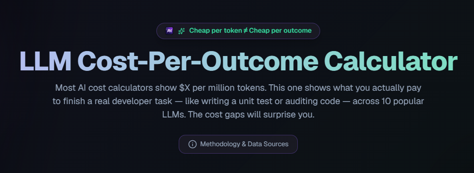

# LLM Cost-Per-Outcome Calculator

**The real cost of finishing a task with an LLM agent — not just the sticker price per million tokens.**

[](https://llm-cost-per-outcome.vercel.app)

[](https://agentnoah.dev)
[](https://llm-cost-per-outcome.vercel.app)
[](https://opensource.org/licenses/MIT)
[](https://github.com/guevae2/llm-cost-per-outcome/issues)

> **→ [Try the live calculator](https://llm-cost-per-outcome.vercel.app)** (no signup, free forever)

---

## What is this?

A free web tool that lets you compare how much it actually costs to complete a real developer task — like writing a unit test, auditing a 500-line file for security bugs, or debugging a stack trace — using 10 different popular LLMs.

You pick:
- **A task type** (unit test, security audit, PR summary, generate API docs, debug stack trace, refactor a function)
- **Which LLMs to compare** (Anthropic, OpenAI, Google, DeepSeek — 10 models total)
- **A retry-rate multiplier** (how often the model needs a second attempt to get it right)

The calculator shows you the **real outcome cost**, sorted cheapest first, with the formula visible. You can also see the quality score for each model from public benchmarks (Aider Leaderboard, LMSys Arena) — and for the security-audit task specifically, from [AgentNoah's K=3 OWASP benchmark](https://agentnoah.dev/blog/3-model-byol-evidence).

---

## Why does this matter?

**Cheap per token ≠ cheap per outcome.**

Imagine two models:
- Model A: $0.10 per million tokens, but gets it right ~60% of the time (1.7× retries)
- Model B: $1.00 per million tokens, gets it right ~95% of the time (1.05× retries)

If your task uses 10K tokens, Model A's cost-per-outcome is `0.001 × 1.7 = $0.0017` and Model B's is `0.01 × 1.05 = $0.0105`. Model B looks 6× more expensive per token, but Model A still wins on this task.

Flip the task to something Model A struggles with — say, security auditing — and the retry rate balloons to 3×. Now A costs `0.001 × 3 = $0.003` but Model B still holds at `0.0105` — and Model A's output is still wrong half the time. Model B wins on absolute reliability even at the higher token price.

**This is the calculation most LLM cost spreadsheets skip.** Vendor pricing pages give you `$X per million tokens`. They don't give you `$X per task you actually finished`. This calculator gives you the second number.

---

## How to use it

### 1. Pick your task

Pick the type of work you want your agent LLM to do. 6 categories available:

| Task | Typical input size | Why it varies per model |
|---|---|---|
| Write a unit test | ~4K tokens | Verbose models write more boilerplate |
| Audit a 500-line file for security bugs | ~12K tokens | Reasoning models use more output tokens for analysis |
| Summarize a PR | ~15K input / ~1K output | Mostly long context, short answer |
| Generate API docs | ~8K input / ~2.5K output | Structured output |
| Debug a stack trace | ~6K input / ~2K output | Multi-step reasoning, higher retry rate |
| Refactor a function | ~5K input / ~1.8K output | Code output, must compile |

### 2. Select LLMs to compare

10 models pre-loaded, organized by vendor and tier:

| Vendor | Frontier | Workhorse | Cheap/Fast |
|---|---|---|---|
| Anthropic | Claude 4.7 Opus | Claude 4.6 Sonnet | Claude 4.5 Haiku |
| OpenAI | GPT-4o | o3-mini | GPT-4o mini |
| Google | Gemini 3.1 Pro | Gemini 3.5 Flash | Gemini 3 Flash |
| Open-weight | — | DeepSeek V3 | — |

All 10 are selected by default. Click a chip to toggle a model on/off.

### 3. Adjust the retry-rate slider

The slider ranges from **0.5x (Optimistic)** — every call succeeds on the first try — to **3.0x (Pessimistic)** — every call needs 3 attempts on average.

Each task category has a sensible default already filled in:
- Unit test: 1.1x (well-defined, models usually nail it)
- Security audit: 1.5x (subtle, model output often needs human review)
- Debug stack trace: 1.6x (multi-step reasoning, more retries)

If you've measured your own retry rates from production telemetry, slide to match.

### 4. Read the result

The Stack-Ranked Outcomes table shows every selected LLM sorted by outcome cost (cheapest first), with a "Cheapest" badge on the winner. The 4 charts give you:

1. **Cost per outcome** — horizontal bar, sorted
2. **Cost vs Quality scatter** — bubble size = retry rate, aim for the bottom-right
3. **Retry-rate sensitivity** — line chart showing how cost changes as the slider moves
4. **Input vs Output cost stack** — pick 2-3 models and see where their cost goes

---

## What's in v0.1

- **10 LLMs** with pricing verified 2026-05-23 (Anthropic, OpenAI, Google, DeepSeek)
- **6 task categories** with per-model token estimates (calibrated to Aider leaderboard patterns)
- **4 chart types** with WCAG AA-compliant `<table>` fallbacks for screen readers
- **Mobile-responsive** dark mode
- **Static client-side calculation** — no backend, no API keys, no tracking
- **Monthly automated pricing-drift check** via GitHub Actions — opens a PR if any vendor's price changes
- **MIT licensed**, community PRs welcome

---

## Data sources (transparent provenance)

Every cell in the calculator has a source badge. We never invent numbers.

| Source | What it covers | Last verified |
|---|---|---|
| [Anthropic pricing](https://www.anthropic.com/pricing) | Claude 4.7 Opus, 4.6 Sonnet, 4.5 Haiku per-Mtok prices | 2026-05-23 |
| [OpenAI pricing](https://openai.com/pricing) | GPT-4o, GPT-4o mini, o3-mini per-Mtok prices | 2026-05-23 |
| [Google Gemini pricing](https://ai.google.dev/pricing) | Gemini 3.1 Pro, 3.5 Flash, 3 Flash per-Mtok prices | 2026-05-23 |
| [DeepSeek pricing](https://api-docs.deepseek.com/pricing) | DeepSeek V3 per-Mtok prices | 2026-05-23 |
| [Aider Leaderboard](https://aider.chat/docs/leaderboards/) | Quality scores for Anthropic + OpenAI models (coding tasks) | 2026-05-23 |
| [LMSys Arena](https://chat.lmsys.org/?arena) | Quality scores for Google + DeepSeek models (general capability) | 2026-05-23 |
| [AgentNoah OWASP K=3 benchmark](https://agentnoah.dev/blog/3-model-byol-evidence) | Quality scores for the **security-audit** task specifically (overrides the general scores above) | 2026-05-23 |

For the security-audit task, the quality scores come from our [3-Model BYOL Evidence study](https://agentnoah.dev/blog/3-model-byol-evidence) — a K=3 replication where each model audited the same 56-file OWASP BenchmarkPython sample 3 independent times. Opus 4.7 and Gemini 3.5 Flash both hit perfect 1.000 Youden scores; Sonnet 4.6 landed at 0.821 ± 0.094; Gemini 3.1 Pro at 0.802 ± 0.107.

---

## Honest limitations

We'd rather you hear these from us than learn them on Hacker News.

1. **Token estimates are calibrated, not measured per-cell.** The numbers in `lib/llms.ts` follow patterns from the Aider leaderboard (frontier models use more tokens for thorough responses; cheap models compress) but aren't direct measurements for every (LLM × task) pair. If you have real measurements, [open an issue](https://github.com/guevae2/llm-cost-per-outcome/issues) — we'll merge data refinements happily.

2. **Retry rates are estimates.** In real systems, a "failed" attempt isn't always a complete retry — it might be a smaller recovery step. The retry-rate slider is a linear proxy that captures the rough cost direction, not a precise measurement.

3. **Quality scores are from public benchmarks, not your codebase.** Aider scores on a specific set of coding tasks; LMSys on Arena-style conversations; AgentNoah on OWASP security samples. Your actual workload may differ.

4. **Prices drift.** Vendors change pricing without notice. We run a monthly GitHub Action that scrapes pricing pages and opens a PR if any number drifts — but between scrapes, displayed prices may lag by a few weeks. The `Last Verified` column on the About page tells you the freshness.

5. **10 LLMs covered, but the world has more.** No Mistral, no LLaMA 3.3 70B, no Cohere Command, no smaller open-weight models. PR additions welcome.

---

## How this was built

This calculator was built end-to-end in one evening using **[AgentNoah BUILD](https://agentnoah.dev)** running on Google Antigravity (Gemini 3.5 Flash workhorse-tier model). Total wall time: ~4 hours founder-driven. Cost to AgentNoah: $0 (BYOL = customer's IDE LLM does the inference). Cost to Vercel: $0 (free tier).

The case study — including the 6 fabrications the review loop caught before launch, plus the 4 additional issues that surfaced during polish/build/close-out — is documented at:

**→ [How we built this in 4 hours on Gemini 3.5 Flash](https://agentnoah.dev/blog/guided-build-flash35-evidence)**

The repo's `BUILD_LOG.md` has the verbatim per-phase verdicts Antigravity wrote during the 15-phase BUILD pipeline. Worth reading if you're curious how AI-driven build methodology actually works in practice.

---

## Run it locally

```bash
git clone https://github.com/guevae2/llm-cost-per-outcome.git
cd llm-cost-per-outcome
npm install
npm run dev
```

Then open `http://localhost:3000`.

Tested with Node.js 20+ and 22+. Built with Next.js 16 (App Router) + React 19 RC + Tailwind CSS + Recharts + TypeScript strict mode.

---

## Contributing

PRs welcome. Most useful contributions:

### Adding a new LLM

1. Open `lib/llms.ts`.
2. Add an entry to `LLM_MODELS` with `inputCostPerM`, `outputCostPerM`, `qualityScore`, `qualityScoreSource`, and `provenance.pricingUrl` (vendor's public pricing page).
3. Add token estimates for the new model to each of the 6 categories in `TASK_CATEGORIES`. If you don't have measurements yet, copy a similar-tier existing model's numbers as a placeholder and note in the PR description.
4. Run `npm test` — the 9 tests should still pass (they check structure, not specific values).
5. Run `npm run build` to verify TypeScript strict mode is clean.
6. Open a PR.

### Refining token estimates with real data

If you have production telemetry showing actual token usage for a specific (LLM × task) pair, that's the most valuable contribution we can get. Open a PR updating the cell with a comment block linking to your data source.

### Reporting outdated pricing

Open an [issue](https://github.com/guevae2/llm-cost-per-outcome/issues) with the vendor name + current price + URL where you saw it. The monthly GitHub Action should catch this automatically, but if you spot it first, file an issue — we'll merge same-day if you can verify.

### Code style

- TypeScript strict mode, no `any`
- Tailwind only (no other CSS framework)
- Match the existing component patterns in `app/`, `components/`, `lib/`
- Keep `<table>` fallbacks in any new chart components for WCAG AA

---

## Tech stack

- **Framework:** Next.js 16 App Router + React 19 RC
- **Language:** TypeScript strict mode
- **Styling:** Tailwind CSS
- **Charts:** Recharts (wrapped in `isMounted` hook for SSR safety)
- **Icons:** lucide-react
- **Tests:** Jest + ts-jest (9 tests covering calculation correctness, OWASP override, sort logic, edge cases, structural integrity)
- **CI:** GitHub Actions monthly pricing-drift workflow
- **Hosting:** Vercel free tier (static client-side calculation, no backend)

---

## License

MIT — see [LICENSE](./LICENSE). Use it, fork it, ship it commercially. Attribution appreciated but not required.

---

## Credits

Built by [Edward Guevarra](https://github.com/guevae2), founder of [AgentNoah](https://agentnoah.dev).

The methodology + 15-phase BUILD pipeline + the 6-fabrications-caught case study comes from AgentNoah's own product. If you want to use the same methodology on your own repos, AgentNoah is in free trial at [agentnoah.dev](https://agentnoah.dev) — install the MCP in your IDE (Claude Code, Cursor, VS Code Copilot, Gemini CLI, or Google Antigravity), and ask your IDE LLM to *"audit my repo with AgentNoah"* or *"use AgentNoah BUILD to build [your feature spec]."* No credit card, 14-day trial.

Discord community: [discord.gg/eUh6AVe6P](https://discord.gg/eUh6AVe6P).
Status page: [agentnoah.betteruptime.com](https://agentnoah.betteruptime.com).

---

*Last updated: 2026-05-23. Pricing data verified same date.*
